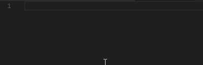
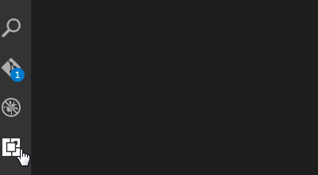

# THF TOTVS Snippets for VS Code

This extension for Visual Studio Code adds snippets for THF TOTVS.



## Usage
Type part of a snippet, press `enter`, and the snippet unfolds.

### Javascript Snippets
```javacript
thfconfig          /// Create the .config file
thfconfigspec      /// Create the .config.spec file
thfcontroller      /// Create the .controller file
thfcontrollerspec  /// Create the .controller.config file
thfdirective       /// Create the .directive file
thfdirectivelite   /// Create the .directive (lite) file
thffunctioncompile /// Create the compile function for .directive file
thffunctionlink    /// Create the link function for .directive file
thfdirectivespec   /// Create the .directive.spec file
thffactory         /// Create the .factory file
thffactory         /// Create the .factory.spec file
thffilter          /// Create the .filter file
thffilterspec      /// Create the .filter.spec file
thfmodule          /// Create the .module file
thfmodulespec      /// Create the .module.spec file
thfprovider        /// Create the .provider file
thfproviderspec    /// Create the .provider.spec file
thfservice         /// Create the .service file
thfservicespec     /// Create the .service.spec file
```

### HTML Snippets
```html
thftpopover                  /// Totvs Template Popover
thftpopoverremoveall         /// Totvs Popover Remove All
thfbutton                    /// Totvs Button
thfcarousel                  /// Totvs Carousel
thfchart                     /// Totvs Chart
thfcheckbox                  /// Totvs Field Checkbox
thfcombo                     /// Totvs Field Combo
thfdaterange                 /// Totvs Date Range Field
thfdatepicker                /// Totvs Datepicker Field
thfdiagram                   /// Totvs Diagram
thfdecimal                   /// Totvs Field Decimal
thfdivider                   /// Totvs Devider
thfpageeditable              /// Totvs Editable Page
thfeditor                    /// Totvs Editor
thfemail                     /// Totvs Email Field
thfexecution                 /// Totvs Executation
thfexecutionitem             /// Totvs Executation Item
thfcanclean                  /// Totvs field canclean
thfgantt                     /// Totvs Gantt
thfgrid                      /// Totvs Grid
thfgridcolumn                /// Totvs Grid Column
thfgridcolumnitem            /// Totvs Grid Column Item
thfgriddetail                /// Totvs Grid Detail
thfgridgroup                 /// Totvs Grid Group
thfgridgroupaggregate        /// Totsvs Grid Group Aggregate
thfgroupcontent              /// Totvs Group Content
thfinput                     /// Totvs Field Input
thfinputrange                /// Totvs Field Input Ramge
thflistitem                  /// Totvs Item of List
thflistitemaction            /// Totvs Item Action of List 
thflistitemcontent           /// Totvs Item List  Content
thflistitemcontentdetail     /// Totvs Item List  Content Detail
thflistitemheader            /// Totvs Item List  Header
thflistiteminfo              /// Totvs Item List  Info
thflistitemtitle             /// Totvs Item List  Title
thflistpagination            /// Totvs List Pagination
thfmodalbody                 /// Totvs Modal Body
thfmodalbody                 /// Totvs Modal Body
thfmodalfooter               /// undefined
thfmodalfooter               /// Totvs Modal Footer
thfmodalheader               /// Totvs Modal Header
thfmultiselect               /// Totvs Multiselect
thfnumber                    /// Totvs Number
thfpage                      /// Totvs Page
thfpagealert                 /// Totvs Page Alert
thfpagebreadcrumb            /// Totvs Page Breadcrumb
thfbreadcrumb                /// Totvs Breadcrumb
thfpagechild                 /// Totvs Page Child
thfpagecontent               /// Totvs Page Content
thfpagecontentheader         /// Totvs Page Content Header
thfpagedetail                /// Totvs Page Detail
thfpagedetailinfo            /// Totvs Page Detail Info
thfpagedetailinfogroup       /// Totvs Page Detail Info Group
thftypeahead                 /// Totvs Typeahead
thfpageheader                /// Totvs Page Header
thfpageheaderoperation       /// Totvs Page Header Operation
thfpageheaderoperationaction /// Totvs  Page Header Operation Action
thfpageheaderoperationfilter /// Totvs Page Header Operation Filter
thfpageheadertitle           /// Totvs Page Header title
thfpagenavbar                /// Totvs Page Navbar
thfpagequickfilter           /// Totvs  Page Quick Filter
thfpagequickselect           /// Totvs Page Quick select
thfphone                     /// Totvs Phone
thfpagetags                  /// Totvs  Page Tags
thfradio                     /// Totvs Radio
thfrow                       /// Totvs Row
thfschedule                  /// Totvs Schedule
thfselect                    /// Totvs Select
thftab                       /// Totvs Tab
thftabdropdown               /// Totvs Tab Dropdown
thftabdropdownitem           /// Totvs Tab Dropdown Item
thftable                     /// Totvs Table
thftabset                    /// Totvs Tabset
thftabsettab                 /// Totvs Tabset Tab
thftime                      /// Totvs Time 
thfupload                    /// Totvs Upload
thfpagewidget                /// Totvs Page Widget
thfpagewidgetbody            /// Totvs Page Widget Body
thfpagewidgetfooter          /// Totvs Page Widget Footer
thfpagewidgetfooteraction    /// Totvs Page Widget Footer Actions
thfpagewidgetfooterbody      /// Totvs Page Widget Footer Body
thfpagewidgetheader          /// Totvs Page Widget Header
```

Alternatively, press `Ctrl`+`Space` (Windows, Linux) or `Cmd`+`Space` (OSX) to activate snippets from within the editor.

## Installation

1. Install Visual Studio Code 0.10.1 or higher
2. Launch Code
3. From the command palette `Ctrl`-`Shift`-`P` (Windows, Linux) or `Cmd`-`Shift`-`P` (OSX)
4. Select `Install Extension`
5. Choose the extension
6. Reload Visual Studio Code


